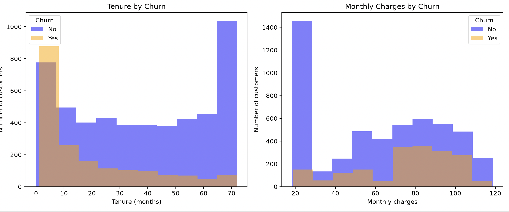

# Telco Customer Churn Prediction Report

## Approach

I used the Telco Customer Churn dataset, which contains 7,043 customers and 21 columns. I removed the customer ID because it does not describe customer behavior. I changed the `Churn` target to numbers: No = 0 and Yes = 1. I also changed `TotalCharges` to a numeric column. Eleven rows had a blank total charge and zero months of service, so I treated those total charges as 0. I converted the text categories into numeric columns using one-hot encoding.

I split the data into training and test sets. The training set had 5,634 customers, and the test set had 1,409. I used stratification so both sets kept a similar proportion of customers who churned.

## Results

I trained K-Nearest Neighbors (KNN) models with several values of K. I compared each model before and after scaling the features. Scaling improved churn recall: the best unscaled result had a recall of 45.45%, while the scaled model with K=11 had a recall of 54.81%.

The scaled K=11 model had 77.29% accuracy, 57.58% churn precision, and 54.81% churn recall. Its confusion matrix showed that it correctly identified 205 customers who churned. It missed 169 customers who churned and incorrectly flagged 151 customers who did not churn.

The graphs suggested that customers with shorter tenure may be more likely to churn. Churn cases also appeared in higher monthly charge ranges. These graphs show customer counts, so they do not prove that a customer with a higher bill has a higher churn rate.

## Recommendations

The company could focus retention efforts on newer customers, especially during their first months of service. It could also review whether customers with high monthly charges need clearer plan choices or support. The model could help identify customers for a small retention campaign, but the company should test the campaign before using it broadly.

## Limitations and Next Steps

The model found only about 55% of the customers who churned, so it still missed many at-risk customers. Its precision was about 58%, meaning some customers flagged for outreach would not churn. The churn and non-churn groups are also imbalanced, with more customers staying than leaving.

I selected K using the same test set used to compare the models, so the reported result may be optimistic. A future version should use cross-validation and compare more models. The business should also compare the cost of missed churn with the cost of contacting customers who would have stayed.

(base) elifyurdakul@Elifs-MacBook-Air-2 lab-sklearn-model-training % /usr/local/bin/python3 /Users/elifyurdak
ul/Downloads/lab-sklearn-model-training/churn_prediction.py
Shape: (7043, 21)
Columns: ['customerID', 'gender', 'SeniorCitizen', 'Partner', 'Dependents', 'tenure', 'PhoneService', 'MultipleLines', 'InternetService', 'OnlineSecurity', 'OnlineBackup', 'DeviceProtection', 'TechSupport', 'StreamingTV', 'StreamingMovies', 'Contract', 'PaperlessBilling', 'PaymentMethod', 'MonthlyCharges', 'TotalCharges', 'Churn']
   customerID  gender  SeniorCitizen Partner  ...              PaymentMethod  MonthlyCharges TotalCharges Churn
0  7590-VHVEG  Female              0     Yes  ...           Electronic check           29.85        29.85    No
1  5575-GNVDE    Male              0      No  ...               Mailed check           56.95      1889.50    No
2  3668-QPYBK    Male              0      No  ...               Mailed check           53.85       108.15   Yes
3  7795-CFOCW    Male              0      No  ...  Bank transfer (automatic)           42.30      1840.75    No
4  9237-HQITU  Female              0      No  ...           Electronic check           70.70       151.65   Yes

[5 rows x 21 columns]

Data types and non-null counts:
<class 'pandas.DataFrame'>
RangeIndex: 7043 entries, 0 to 7042
Data columns (total 21 columns):
 #   Column            Non-Null Count  Dtype  
---  ------            --------------  -----  
 0   customerID        7043 non-null   str    
 1   gender            7043 non-null   str    
 2   SeniorCitizen     7043 non-null   int64  
 3   Partner           7043 non-null   str    
 4   Dependents        7043 non-null   str    
 5   tenure            7043 non-null   int64  
 6   PhoneService      7043 non-null   str    
 7   MultipleLines     7043 non-null   str    
 8   InternetService   7043 non-null   str    
 9   OnlineSecurity    7043 non-null   str    
 10  OnlineBackup      7043 non-null   str    
 11  DeviceProtection  7043 non-null   str    
 12  TechSupport       7043 non-null   str    
 13  StreamingTV       7043 non-null   str    
 14  StreamingMovies   7043 non-null   str    
 15  Contract          7043 non-null   str    
 16  PaperlessBilling  7043 non-null   str    
 17  PaymentMethod     7043 non-null   str    
 18  MonthlyCharges    7043 non-null   float64
 19  TotalCharges      7032 non-null   float64
 20  Churn             7043 non-null   str    
dtypes: float64(2), int64(2), str(17)
memory usage: 1.1 MB

Missing values:
customerID           0
gender               0
SeniorCitizen        0
Partner              0
Dependents           0
tenure               0
PhoneService         0
MultipleLines        0
InternetService      0
OnlineSecurity       0
OnlineBackup         0
DeviceProtection     0
TechSupport          0
StreamingTV          0
StreamingMovies      0
Contract             0
PaperlessBilling     0
PaymentMethod        0
MonthlyCharges       0
TotalCharges        11
Churn                0
dtype: int64

Churn distribution:
Churn
No     5174
Yes    1869
Name: count, dtype: int64
      tenure  MonthlyCharges
488        0           52.55
753        0           20.25
936        0           80.85
1082       0           25.75
1340       0           56.05
3331       0           19.85
3826       0           25.35
4380       0           20.00
5218       0           19.70
6670       0           73.35
6754       0           61.90
Missing TotalCharges after conversion: 11
      tenure  MonthlyCharges  TotalCharges
488        0           52.55           NaN
753        0           20.25           NaN
936        0           80.85           NaN
1082       0           25.75           NaN
1340       0           56.05           NaN
3331       0           19.85           NaN
3826       0           25.35           NaN
4380       0           20.00           NaN
5218       0           19.70           NaN
6670       0           73.35           NaN
6754       0           61.90           NaN
Missing TotalCharges: 11
      tenure  MonthlyCharges
488        0           52.55
753        0           20.25
936        0           80.85
1082       0           25.75
1340       0           56.05
3331       0           19.85
3826       0           25.35
4380       0           20.00
5218       0           19.70
6670       0           73.35
6754       0           61.90
Missing values remaining: 0
TotalCharges type: float64
Shape after encoding: (7043, 31)
Remaining text columns: []
   SeniorCitizen  tenure  ...  PaymentMethod_Electronic check  PaymentMethod_Mailed check
0              0       1  ...                               1                           0
1              0      34  ...                               0                           1
2              0       2  ...                               0                           1
3              0      45  ...                               0                           0
4              0       2  ...                               1                           0

[5 rows x 31 columns]
Accuracy: 0.765791341376863
Churn precision: 0.579136690647482
Churn recall: 0.4304812834224599
Confusion matrix:
[[918 117]
 [213 161]]
              precision    recall  f1-score   support

    No Churn       0.81      0.89      0.85      1035
       Churn       0.58      0.43      0.49       374

    accuracy                           0.77      1409
   macro avg       0.70      0.66      0.67      1409
weighted avg       0.75      0.77      0.75      1409

Model trained!
X shape: (7043, 30)
Training set: (5634, 30)
Test set: (1409, 30)
Churn counts in y:
Churn
0    5174
1    1869
Name: count, dtype: int64
K=1: Accuracy=0.7119, Churn Precision=0.4570, Churn Recall=0.4545
K=3: Accuracy=0.7622, Churn Precision=0.5657, Churn Recall=0.4492
K=5: Accuracy=0.7658, Churn Precision=0.5791, Churn Recall=0.4305
K=7: Accuracy=0.7814, Churn Precision=0.6260, Churn Recall=0.4385
K=9: Accuracy=0.7885, Churn Precision=0.6532, Churn Recall=0.4332
K=11: Accuracy=0.7871, Churn Precision=0.6623, Churn Recall=0.4037
K=15: Accuracy=0.7899, Churn Precision=0.6726, Churn Recall=0.4064
Scaled K=1: Accuracy=0.7161, Churn Precision=0.4667, Churn Recall=0.4866
Scaled K=3: Accuracy=0.7438, Churn Precision=0.5177, Churn Recall=0.5080
Scaled K=5: Accuracy=0.7473, Churn Precision=0.5253, Churn Recall=0.5000
Scaled K=7: Accuracy=0.7594, Churn Precision=0.5499, Churn Recall=0.5160
Scaled K=9: Accuracy=0.7693, Churn Precision=0.5679, Churn Recall=0.5481
Scaled K=11: Accuracy=0.7729, Churn Precision=0.5758, Churn Recall=0.5481
Scaled K=15: Accuracy=0.7700, Churn Precision=0.5706, Churn Recall=0.5401
Final accuracy: 0.772888573456352
Final churn precision: 0.5758426966292135
Final churn recall: 0.5481283422459893
Final confusion matrix:
[[884 151]
 [169 205]]
              precision    recall  f1-score   support

    No Churn       0.84      0.85      0.85      1035
       Churn       0.58      0.55      0.56       374

    accuracy                           0.77      1409
   macro avg       0.71      0.70      0.70      1409
weighted avg       0.77      0.77      0.77      1409